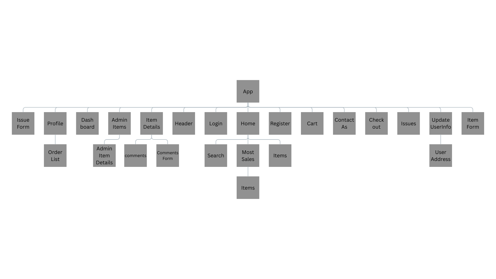

# ShopEase-back-end
# Date 8/7/2025
# By: Ali Hasan, Qassim Aldearzi, Zeshan Ahmed, Abdulla Zaid
#### Desciption
An e-commerce website is a digital platform that enables individuals to buy goods over the internet. It provides an online storefront where customers can browse products, view detailed descriptions, compare prices, and complete purchases through secure payment gateways. E-commerce websites can serve various industries, ranging from retail and fashion to electronics and digital products, offering customers the convenience of shopping anytime and anywhere.

## Deployment version

[Here](#)

## Key features:
-  Product search and filtering
-  Shopping cart functionality
-  User accounts
-  Order tracking
-  Customer support tools
---

### Pseudocode

#### User

- User can registe to create an account 
- User can search for specifc items or with filterd categories
- User can view items or specific item

#### Customer

- Customer can search for specifc items or with filterd categories
- Customer can view items or specific item
- Customer can buy items
- Customers can share feedback or compliments about their shopping    experience.
- Customer can contact with admins
- Customer can edit his/her Profile
- Customers can report an issue with an item.

#### Admin

- Admin can add an items
- Admin can view statistics about profit
- Admin can delete or edit an items
- Admin can review reported issues.

###

---

### Entity Relationship Diagram

---

### Component diagram

### _Technology Stack:_

- **Front-end:** [React](https://react.dev/learn), [JavaScript](https://developer.mozilla.org/en-US/docs/Web/JavaScript), [CSS](https://developer.mozilla.org/en-US/docs/Web/CSS), [HTML](https://developer.mozilla.org/en-US/docs/Web/HTML), [Axios](https://axios-http.com/docs/intro), [Chart.js](https://www.chartjs.org/docs/latest/), [Js-cookie](https://www.npmjs.com/package/js-cookie),